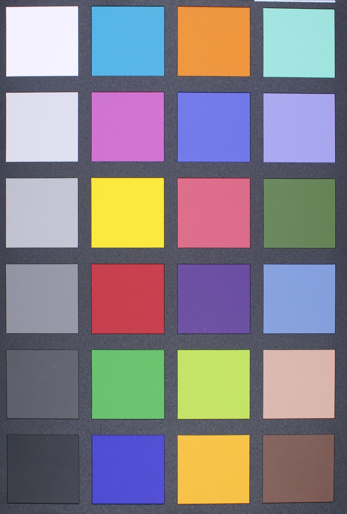

# Canned-Bean-Color-Detection-Pipeline

## Download Pretrained SAM Models
Download the pretrained SAM models into the models directory.

**For Windows Users:**
- [sam_vit_b_01ec64.pth](https://dl.fbaipublicfiles.com/segment_anything/sam_vit_b_01ec64.pth)
- [sam_vit_l_0b3195.pth](https://dl.fbaipublicfiles.com/segment_anything/sam_vit_l_0b3195.pth)
- [sam_vit_h_4b8939.pth](https://dl.fbaipublicfiles.com/segment_anything/sam_vit_h_4b8939.pth)

**For macOS / Ubuntu / Linux Users:**
```bash
wget https://dl.fbaipublicfiles.com/segment_anything/sam_vit_b_01ec64.pth
wget https://dl.fbaipublicfiles.com/segment_anything/sam_vit_l_0b3195.pth
wget https://dl.fbaipublicfiles.com/segment_anything/sam_vit_h_4b8939.pth
```

## Setup Environment
**Create Virtual Environment**
```bash
python -m venv venv
```
**Activate Virtual Environment**
```bash
source venv/bin/activate
```
**Install Dependencies**
```bash
pip install -r requirements.txt
```

## Instructions to Run the Pipeline
**Step 1: Upload Images and Color Checker**
* Delete the existing ./input/images folder (if it exists), then create a new one.
* Upload all your input images into the newly created ./input/images directory.
* Upload the color checker image to the ./input folder and name it exactly as color_checker.

**Important Guidelines for the Color Checker**
* The image must be in horizontal orientation (i.e., width > height).
* Ensure the edges of the color checker are clearly visible and aligned.
* A sample color checker image is shown below for reference.


**Step 2: Make Appropriate Changes to Job Script**
* Open the run_pipeline.sh file.
* Update the paths in the file accordingly.
* Replace the email address with your own (using your NetID) in the #SBATCH --mail-user field.
* The pipeline might take approximately 30 minutes to process 1000 images, so update the #SBATCH --time value accordingly to ensure the job runs long enough.

## Results
Once the pipeline completes successfully, the results will be available in the output folder:
- detection/: Contains images with detected beans. Detected beans is highlighted with a red bounding box.
- segmentation/: Contains images with segmented beans, highlighted in green to indicate the segmentation mask.
- patches/: Contains the 24 extracted patches used to calibrate the L, A, and B values.
- results.csv: Contains D scores for all the images, along with L, A, B values before and after color calibration.

**Debugging Tips:**
* Check the error.err file in the job_logs directory for the reason behind the job failure.
* Check the output.out file in the job_logs directory to identify the step where the issue occurred.
* Review the detection, segmentation, and patches outputs to determine the root cause of the issue.